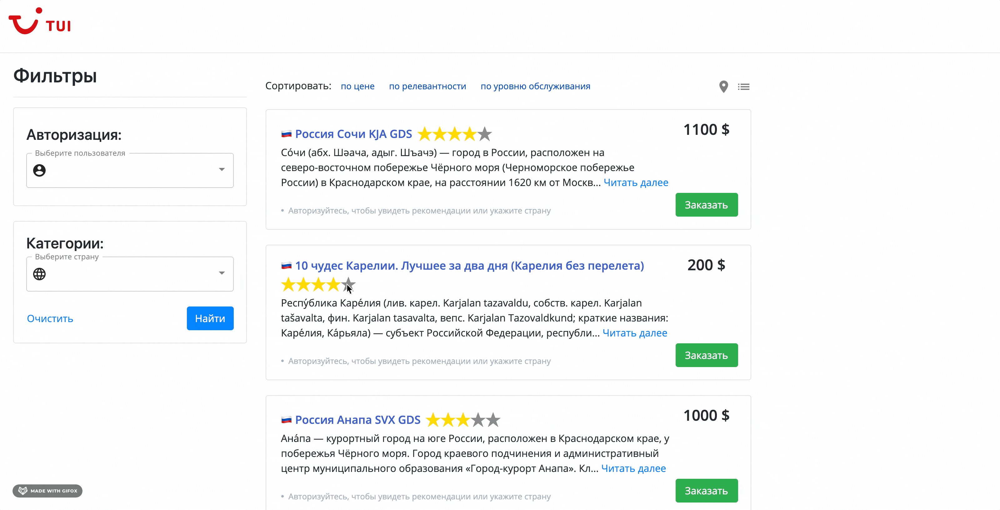

# Сервис персонализированных предложений для сайта туроператора TUI
https://travelhack.moscow/task/tui/


[](https://github.com/psf/black)


# Демо


### Описание бизнес-процесса, который хочется улучшить

В настоящий момент на сайте tui.ru не ведется аналитика, которая могла бы позволить делать персонализированные
предложения клиентам. На новом сайте предполагается создание сервиса, позволяющего формировать **индивидуальную
выдачу/подбор** предложений для потенциального туриста.

# 🚀 Запуск сервиса
1. Установить **python3.8** и менеджер пакетов **poetry**. [Как установить poetry](https://python-poetry.org/docs/#osx-linux-bashonwindows-install-instructions)
2. Инициализировать виртуальное окружение и установить зависимости
```bash
poetry shell
poetry install
```
3. Подготовить данные и обучить модели
```bash
make data
make fit
```
4. Собрать docker-образы и запустить все
```bash
make build
make start
```

## ⚙️ Памятка для DS/ML ресерча

Запуск **Jupyter Notebook**:

- установить менеджер зависимостей **poetry**
- `poetry install`
- `make jupyter`

Добавить пакеты (например, `catboost`):

- если `catboost` нужен на бэкенде, то `poetry add catboost`
- если `catboost` нужен только при ресерче в Jupyter Notebook, то `poetry add catboost --dev`

Удалить пакет
`poetry remove catboost`
